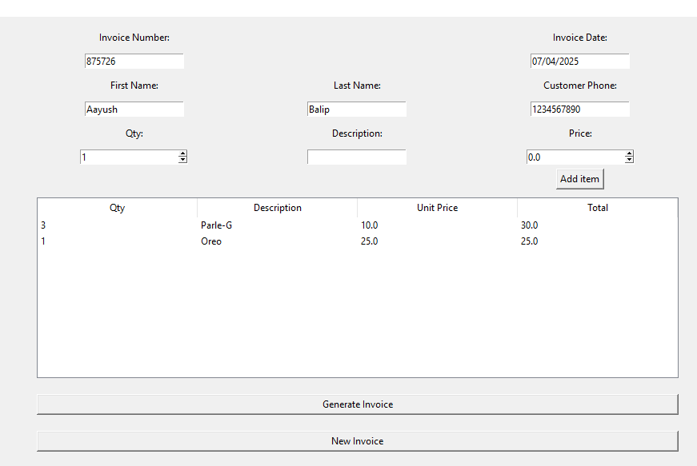
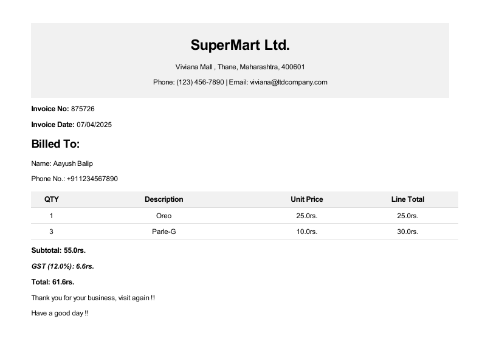
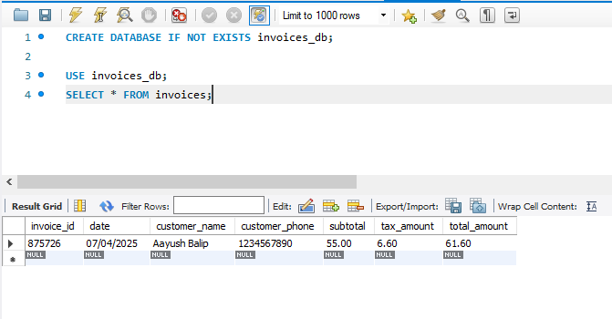

```markdown
# 🧾 Invoice Generator Desktop App (Tkinter + MySQL + PDF)

This is a desktop application built using **Tkinter** for GUI, **MySQL** for database storage, and **pdfkit** with **Jinja2** to generate styled invoice PDFs.

---

## 📸 Preview

### 1️⃣ Main Dashboard



### 2️⃣ Generated PDF Output



### 3️⃣ SQL Database Results



---

## 🛠 Features

- Add customer and product details
- Save invoice and items to a MySQL database
- Automatically calculate totals with tax
- Generate professional PDF invoices using Jinja2 templates
- Reset and create new invoices easily

---

## 🧾 Getting Started

### 1️⃣ Clone the Repository

```bash
git clone https://github.com/yourusername/invoice-generator.git
cd invoice-generator
```

### 2️⃣ Install Python Packages

Make sure Python is installed, then run:

```bash
pip install -r requirements.txt
```

### 3️⃣ Set Up the Database

1. Open MySQL.
2. Create the database manually:

```sql
CREATE DATABASE invoices_db;
```

3. Execute the SQL schema:

```bash
mysql -u root -p invoices_db < invoice_db.sql
```

> ⚠️ **IMPORTANT:** In `main.py`, replace this line:

```python
password="YOUR_PASSWORD"
```

with your actual MySQL root password.

---

### 4️⃣ Install wkhtmltopdf

To generate PDFs, install [wkhtmltopdf](https://wkhtmltopdf.org/downloads.html):

- Download the correct version for your OS.
- During installation, **add it to your system PATH**, or manually set the path in the script like this:

```python
config = pdfkit.configuration(wkhtmltopdf="C:/Program Files/wkhtmltopdf/bin/wkhtmltopdf.exe")
```

---

## 🚀 Run the Application

```bash
python main.py
```

---

## ✅ Notes

- Customize `invoice_template.html` for your branding.
- Update MySQL password in `connect_db()` before running.
- Make sure `wkhtmltopdf` is installed and reachable from your script.

---